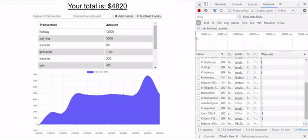

# budget-tracker

## Description
An application to keep help keep track of budgets and spending habits. Add the name of the transaction, the amount and then click the corresponding button of whether the amount is to be added or subtracted from the funds. All past transactions will be listed and a graph displays the current funds amount after each transaction and the date the transaction was made on. Transactions can also be made offline i.e. without internet connection, and will be added to the transaction history once back online.

## User Story
AS A user  
I WANT to be able to keep track of my transactions regardless of my internet connection  
SO THAT I will always have an accurate balance display of my account

## Usages
Type in transaction name and amount into the corresponding input boxes and click the button for whether the amount is to be added or subtracted. This is a Progressive Web App, so after going to the site in the browser of a mobile device it is then able to be added to the device's home screen and can then be used/accessed like any other app. 

## Installation
The app can be used through the deployed site below, but if you want to clone the repo, the application requires Node.js and MongoDB to be installed. 
1. Check if Node.js is installed by entering `node --version` into the command line. If it is installed, a version number should be displayed. 
   - If not, it can be [downloaded from their website](https://nodejs.org/en/download/), then check if it was installed properly by performing `node --version` 
2. If the command `mongod` or `mongo` is not recognised in the command line, MongoDB has not been installed. [Follow the guides here for your OS](https://docs.mongodb.com/manual/installation/)
3. Run `npm install` in the command line to install all dependencies
4. To run locally, run `node server` in the command line and then open localhost:3000 in your browser

## Deployed Site
https://personalbudgettracker.herokuapp.com/
